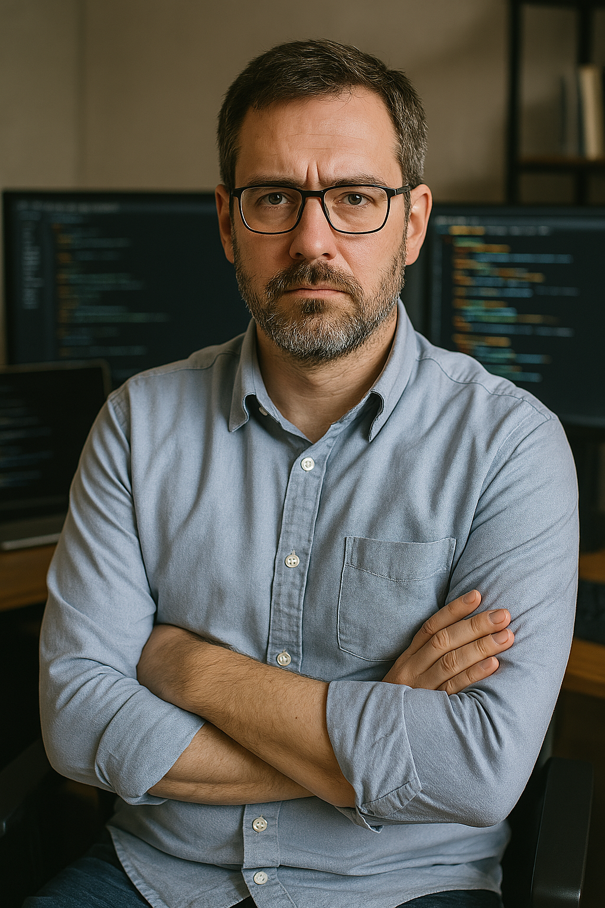

# Persona: Aris Thorne - The Legacy Code Modernizer

**Quote:** *"This COBOL monolith has run our core transactions for 30 years. It's stable, but it's an undocumented black box slowing us to a crawl. We *have* to modernize, but breaking the business logic is unthinkable. We need a bridge, not a wrecking ball – and maybe a map of where we're starting from."*

---

**Who is Aris?**

*   **Name:** Aris Thorne
*   **Age:** 44
*   **Role:** Technical Lead / Senior Staff Engineer
*   **Company:** "FinSecure Corp" (Large Financial Services)
*   **Experience:** 15+ Years (Infrastructure -> Backend -> Lead)

Aris is the kind of engineer who grounds high-level strategy in practical reality. He's pragmatic, meticulous, and inherently risk-averse when dealing with the systems that keep FinSecure running. With over fifteen years under his belt, he's seen enough tech cycles to be skeptical of hype but genuinely seeks powerful tools that offer control and verifiable outcomes. He believes in solid engineering, clear processes, and enabling his team to do their best work, even if he sometimes comes across as slightly cynical about vendor promises.

**The Mountain to Climb: TITAN**

Aris's current, daunting task is leading the modernization of "TITAN," FinSecure's core transaction processing monolith. Built primarily in COBOL decades ago, with aging Perl reporting scripts clinging to its sides, TITAN is the definition of a critical legacy system running on infrastructure the company is desperate to leave behind. **Critically, decades of undocumented patches have turned it into an opaque black box; understanding the *precise* business logic, let alone the rationale behind certain obscure sections, is an exercise in archaeology.** This makes modifications perilous – small changes ripple unpredictably, demanding exhaustive manual testing. Consequently, development crawls. Adding new features or integrating with modern, API-driven systems is painfully slow, expensive, and fraught with risk. Compounding this is the widening skills gap – finding engineers proficient in both COBOL and modern systems is a constant struggle. All the while, security and compliance pressures are mounting, making TITAN's integration limitations a growing concern.

**The Drive for Change**

This situation leaves Aris deeply frustrated. He's frustrated by the system's opaqueness, the constant fear of breaking something critical, and the prohibitive cost and time estimates for any meaningful change, especially a full manual rewrite. His primary goal is clear: migrate TITAN's core logic to modern Go microservices, potentially using Python 3 for some surrounding functions, but with two non-negotiable conditions: **first, gaining a much better understanding of the *existing* logic, and second, achieving absolute functional equivalence** in the translation. Breaking the logic that handles millions in transactions daily is simply unthinkable.

Therefore, Aris needs more than just a translation tool. He needs **insight into the legacy system itself**, potentially uncovering hidden assumptions or forgotten business rules. He requires **verifiable proof** of equivalence through robust validation strategies like differential testing. He needs **control** over the process – guiding the style, library choices, and standards of the generated code, ensuring it fits FinSecure's environment. He needs **ironclad security**, demanding a solution that operates entirely within their on-premise infrastructure, never letting sensitive source code leave their control. And fundamentally, he needs a way to **accelerate** this monumental task, freeing his team from tedious manual translation *and* exhaustive upfront archaeology to focus on higher-value validation, integration, and targeted refactoring. He wants to empower his team, giving them tools that illuminate the *original* codebase, generate useful tests for the *new* code, and move them towards modern practices.

**Aris's Toolkit:**

*   **Legacy:** Reads/debugs COBOL, familiar with Perl & mainframe concepts.
*   **Modern:** Proficient in Go & Python; strong grasp of microservices, APIs (REST/gRPC), Docker, Kubernetes, CI/CD (GitLab CI), PostgreSQL.
*   **Tools:** Git, Linux/Unix, VS Code, Go/Python testing frameworks. Aware of AI/ML concepts.

**Aris Meets CodeRelic: The Scenario**

When Aris encounters CodeRelic, his approach is methodical. He sets up a project, carefully pointing it to the TITAN codebase in their internal Git repo. **Crucially, in the project configuration, he enables the "Generate Legacy Documentation" feature alongside setting the Go microservice target.** He applies FinSecure's formatting standards, specifies preferred libraries, and connects CodeRelic to their on-premise database, object storage, and internal LLM endpoint. He initiates the pipeline, monitoring its progress through parsing, analysis, IR generation, **legacy documentation generation**, transformation, and modern code generation.

His real work begins in the review phase. Aris first explores the **generated legacy documentation artifacts**. He examines the **commented copy of the COBOL code**, noting the AI-generated explanations for complex paragraphs or data divisions. He cross-references this with the **external Markdown documentation**, reviewing the summaries of program structure, call graphs, and inferred logic for key transaction paths. This provides his team with a much-needed baseline understanding before diving into the translated code.

Next, he utilizes the **Side-by-Side Differencing view**. He might compare the *original* COBOL to the *commented* COBOL to assess the quality of the legacy documentation, then compare the *commented* COBOL against the *translated* Go code. This allows him to meticulously track how specific, now better-understood, legacy sections were modernized. He pays close attention to areas flagged by CodeRelic, reads the auto-generated comments explaining *translation* choices, and uses the insights from the legacy documentation to better validate how original patterns were mapped.

Then comes the critical validation step: he configures the Differential Testing module, linking it to their mainframe emulator environment and the deployed Go test service. He feeds it historical transaction data, scrutinizing the output comparison reports for any deviations, however minor. The context provided by the legacy documentation often helps in diagnosing the root cause of any discrepancies found during this stage. Based on this feedback loop (understanding the old, comparing the new, testing equivalence), he might tweak CodeRelic's configuration for another run or use the high-quality generated Go code as a starting point for targeted manual refinement by his team. Finally, his team utilizes the generated test stubs, OpenAPI specs, and Dockerfiles, integrating the nascent Go microservices into their standard CI/CD pipelines and testing frameworks, now armed with a better understanding of both the original system and its modern equivalent.

**Why CodeRelic Resonates with Aris**

For Aris, CodeRelic isn't just another tool; it's a potential lifeline for the TITAN project. It directly addresses his core needs by promising to:
*   **Illuminate the Black Box:** The legacy documentation generation feature offers unprecedented insight into TITAN's arcane logic, reducing the time and risk associated with manual code archaeology.
*   **De-risk the Migration:** Better understanding the original system *before* translation, combined with automated assistance during translation, significantly reduces the chance of misinterpreting logic or introducing errors.
*   **Provide Validation:** Its focus on functional equivalence, particularly the differential testing capability bolstered by the context from legacy docs, provides the verification mechanism he craves.
*   **Ensure Security:** The mandatory on-premise nature satisfies FinSecure's stringent security requirements.
*   **Accelerate the Timeline:** By automating both initial understanding (via legacy docs) and the translation itself, it allows his team to focus on verification, integration, and value-added refactoring.
*   **Offer Developer Control:** He can still guide the output style and standards for the modern code.
*   **Empower the Team:** It gives his team a foundation – generated legacy insights, test stubs for the new code, basic structure – allowing them to build upon it confidently and move towards modern practices more quickly.